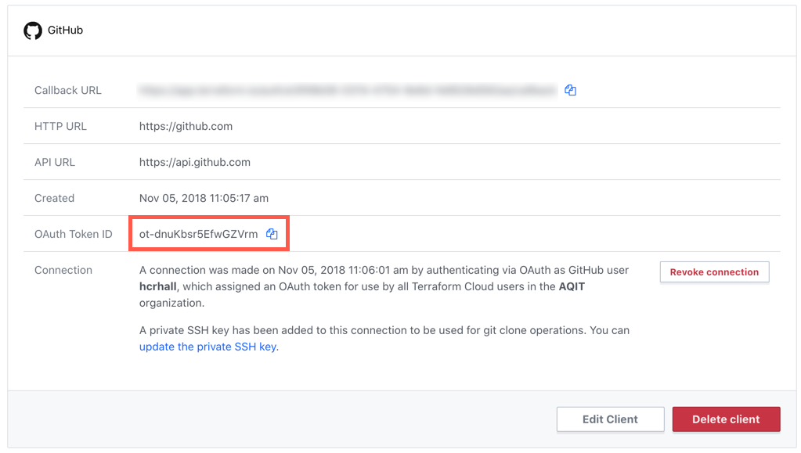
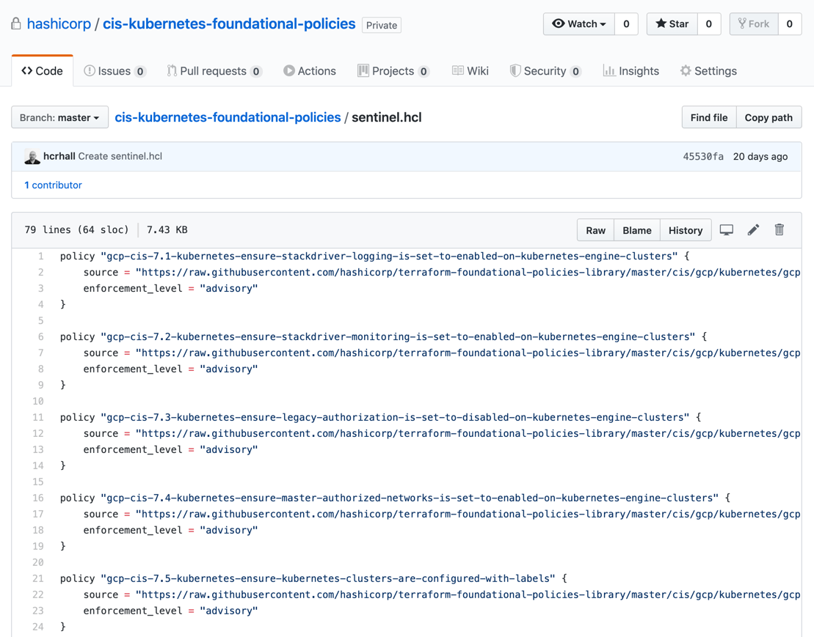
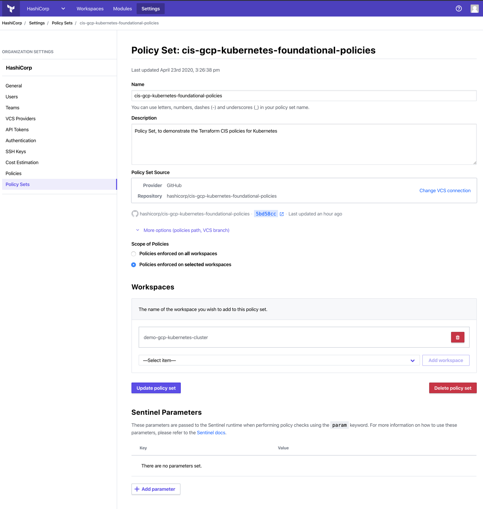
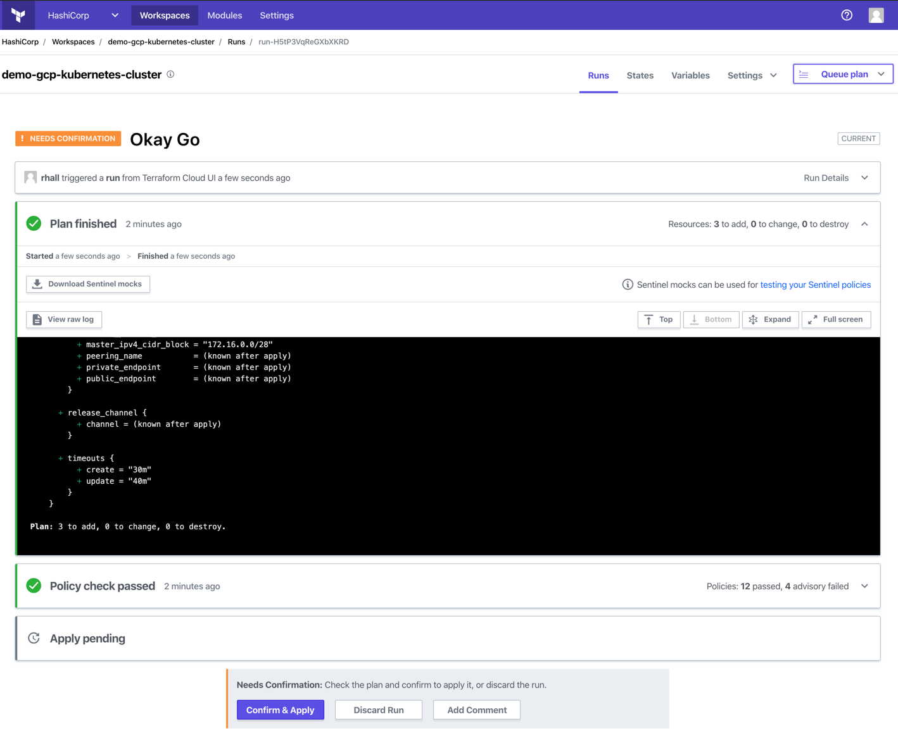
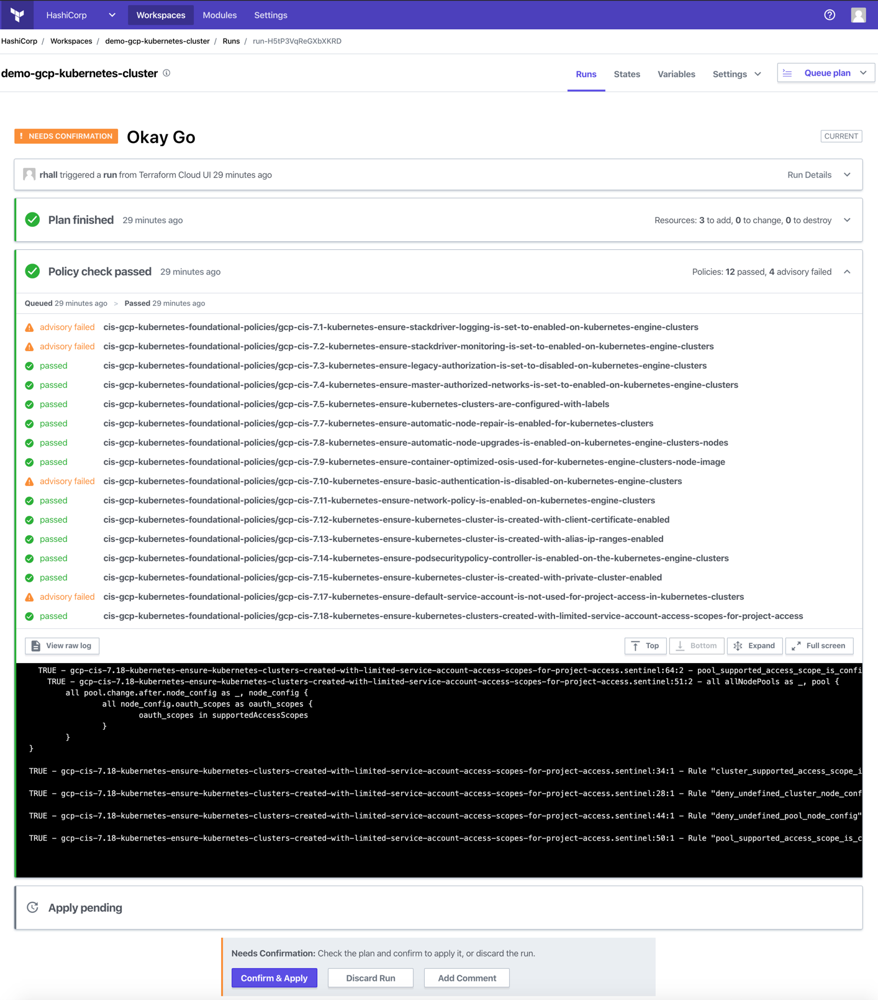

> **Disclaimer**
> 
> For demonstration purposes only

# Terraform Foundational Policies Demonstration 
This demonstration uses Terraform Cloud to provide a working example of how the Terraform Foundational Policy Library can be used to enforce controls for a Kubernetes Cluster running in GCP. 

---

## Table of Contents
- [Prerequisites](#Prerequisites)
- [Setup](#setup)
- [Provision Demo Resources](#provision-demo-resources)
- [Demo Script](#demo-script)
- [References](#references)

---

## Prerequisites

↥ [back to top](#table-of-contents)

This demo setup assumes that you already have completed the following:

1. [Created a GitHub Organization](https://help.github.com/en/enterprise/2.16/admin/user-management/creating-organizations) 
1. [Signed up or have access to Terraform Cloud](https://app.terraform.io/signup/account) or have access to Terraform Cloud
1. [Finished the Getting Started with Terraform Cloud](https://www.terraform.io/docs/cloud/getting-started/index.html)
1. [Signed up or have access to the Google Cloud Platform](https://cloud.google.com/free) 
1. [Created a Google Cloud Project](https://cloud.google.com/resource-manager/docs/creating-managing-projects)

> **Important!**
>
> This demo does not support the Github free tier. You will need to setup an organization by following the links above before progressing any further. GitHub organizations and team collaboration are now a free feature. You can find out more by reviewing the [**GitHub is now free for teams**](https://github.blog/2020-04-14-github-is-now-free-for-teams/) announcement.
>
> This demo also requires that you create a [GitHub Personal Access Token](https://help.github.com/en/github/authenticating-to-github/creating-a-personal-access-token-for-the-command-line) with `repo`, `admin:org` and `delete_repo` scope permissions.

---

## Setup

↥ [back to top](#table-of-contents)

1. Login to Terraform Cloud via the CLI and follow the prompts

```bash
$ terraform login
```
> **Important!**
> 
> Save the generated token somewhere safe because you will be using it in the next step when you define the value of the `tfe_token` input variable.

1. Create a `secret.auto.tfvars` file and update the contents as follows:
```
tfe_organization      = "YOUR_ORG_NAME_HERE"
tfe_hostname          = "app.terraform.io"
tfe_token             = "YOUR_TFE_USER_TOKEN_HERE"
github_token          = "YOUR_GITHUB_USER_TOKEN_HERE"
github_organization   = "YOUR_GITHUB_ORGANIZATION_NAME_HERE"
github_oauth_token_id = "YOUR_VCS_PROVIDER_OAUTH_TOKEN_ID"
gcp_keyfile_json_path = "PATH_TO_YOUR_GCP_KEYFILE_JSON"
gcp_project           = "GCP_PROJECT_NAME"
gcp_region            = "GCP_REGION"
```
> **Note:** 
> 
> The `.gitignore` has been configured to exclude all `*.auto.tfvars` and `*.json` files in order to prevent the leaking of secrets.
> 
> You can identify the value of the github_oauth_token_id by browsing to **Settings** ⮕ **VCS Providers** and copying the value of **OAUTH Token ID**.
> 

2. Update the organization name in the [backend.hcl](./backend.hcl)

```
workspaces { name = "terraform-governance-demos" }
hostname     = "app.terraform.io"
organization = "YOUR_ORG_NAME_HERE"
```

---

## Provision Demo Resources

↥ [back to top](#table-of-contents)

1. Initialize the Terraform workspace 

```bash
$ terraform init -backend-config=backend.hcl

Initializing the backend...

Successfully configured the backend "remote"! Terraform will automatically
use this backend unless the backend configuration changes.

Initializing provider plugins...
- Checking for available provider plugins...
- Downloading plugin for provider "github" (hashicorp/github) 2.6.1...
- Downloading plugin for provider "tfe" (hashicorp/tfe) 0.16.0...

The following providers do not have any version constraints in configuration,
so the latest version was installed.

To prevent automatic upgrades to new major versions that may contain breaking
changes, it is recommended to add version = "..." constraints to the
corresponding provider blocks in configuration, with the constraint strings
suggested below.

* provider.github: version = "~> 2.6"
* provider.tfe: version = "~> 0.16"

Terraform has been successfully initialized!

You may now begin working with Terraform. Try running "terraform plan" to see
any changes that are required for your infrastructure. All Terraform commands
should now work.

If you ever set or change modules or backend configuration for Terraform,
rerun this command to reinitialize your working directory. If you forget, other
commands will detect it and remind you to do so if necessary.
```

> **Note:**
>
> In this demo we are initializing a remote backend in Terraform Cloud using [Remote Operations](https://www.terraform.io/docs/backends/operations.html). Once the `init` phase has completed you will notice that a new workspace called `terraform-governance-demos` has been created in your Terraform organization. The primary responsibility of this workspace is to bootstrap the demo environment (repository(s), workspace, policy set, config etc.). Running `terraform destroy` will not delete this workspace. This is a manual operation and will need to be carried out from within the Terraform Cloud UI.

3. Review the plan
```bash
$ terraform plan

Running plan in the remote backend. Output will stream here. Pressing Ctrl-C
will stop streaming the logs, but will not stop the plan running remotely.

Preparing the remote plan...

To view this run in a browser, visit:
https://app.terraform.io/app/your_org_name/terraform-governance-demos/runs/run-i45QeMDuW4Vi2Lmk

Waiting for the plan to start...

Terraform v0.12.24
Configuring remote state backend...
Initializing Terraform configuration...
2020/04/23 00:56:41 [DEBUG] Using modified User-Agent: Terraform/0.12.24 TFC/c23d54d1dd
Refreshing Terraform state in-memory prior to plan...
The refreshed state will be used to calculate this plan, but will not be
persisted to local or remote state storage.
...
Plan: 11 to add, 0 to change, 0 to destroy.
```

4. Apply the changes
```bash
$ terraform apply

Running apply in the remote backend. Output will stream here. Pressing Ctrl-C
will cancel the remote apply if it's still pending. If the apply started it
will stop streaming the logs, but will not stop the apply running remotely.

Preparing the remote apply...

To view this run in a browser, visit:
https://app.terraform.io/app/your_org_name/terraform-governance-demos/runs/run-WCfA7rdBy8Ke5Xc6

Waiting for the plan to start...

Terraform v0.12.24
Configuring remote state backend...
Initializing Terraform configuration...
2020/04/23 00:59:29 [DEBUG] Using modified User-Agent: Terraform/0.12.24 TFC/c23d54d1dd
Refreshing Terraform state in-memory prior to plan...
The refreshed state will be used to calculate this plan, but will not be
persisted to local or remote state storage.


------------------------------------------------------------------------

An execution plan has been generated and is shown below.
Resource actions are indicated with the following symbols:
  + create

Terraform will perform the following actions:
...
Plan: 11 to add, 0 to change, 0 to destroy.

Do you want to perform these actions in workspace "terraform-governance-demos"?
  Terraform will perform the actions described above.
  Only 'yes' will be accepted to approve.

  Enter a value: Yes
```
---

## Demo Script

↥ [back to top](#table-of-contents)

1. In GitHub, show the policy configuration by browsing to your organization, selecting the `cis-gcp-kubernetes-foundational-policies` repository and reviewing the contents of the `sentinel.hcl` file.



1. In Terraform, show the Terraform configuration by browsing to the organizational settings and viewing the configuration of the `cis-gcp-kubernetes-foundational-policies` Policy Set. 



>**Important!**
>
>Talk through the scoping of the Policy Set and configure the scope to apply to the `demo-gcp-kubernetes-cluster` workspace. Also talk through working directories and branches etc.

3. In Terraform, show the plan by browsing to the latest run on the `demo-gcp-kubernetes-cluster` workspace and review the results for the `Plan`.



1. In Terraform, show the policy evaluation by reviewing the results for the `Policy Check`.



5. In Terraform, discard the run and resolve the logging and monitoring failures by updating the `main.tf` with the following:

```terraform
  # 7.1 Ensure Stackdriver Logging is set to Enabled on Kubernetes Engine Clusters
  # Default: logging.googleapis.com/kubernetes
  # NOTE: Can also be logging.googleapis.com

  logging_service = "logging.googleapis.com/kubernetes"

  # 7.2 Ensure Stackdriver Monitoring is set to Enabled on Kubernetes Engine Clusters
  # Default: monitoring.googleapis.com/kubernetes
  # NOTE: Can also be monitoring.googleapis.com

  monitoring_service = "monitoring.googleapis.com/kubernetes"
```

6. Commit and push the new changes to the `demo-gcp-kubernetes-cluster` GitHub repository

> **Note:**
>
> As an alternative you can also run `terraform apply -auto-approve` which will pick up the file change and use the GitHub provider to push the changes to the `demo-gcp-kubernetes-cluster` GitHub repository

7. In Terraform, show the policy evaluation by reviewing the results for the `Policy Check`.


---

## References

↥ [back to top](#table-of-contents)

### Terraform Cloud / Enterprise
- [Creating Terraform User API Tokens](https://www.terraform.io/docs/cloud/users-teams-organizations/users.html#api-tokens)

### GitHub
- [Creating a personal access token for the command line](https://help.github.com/en/github/authenticating-to-github/creating-a-personal-access-token-for-the-command-line)
- [Managing GitHub with Terraform](https://www.hashicorp.com/blog/managing-github-with-terraform/)

### Google Cloud Platform
- [Creating Your Project](https://cloud.google.com/appengine/docs/standard/nodejs/building-app/creating-project)
- [Creating and managing service account keys](https://cloud.google.com/iam/docs/creating-managing-service-account-keys)
- [Regions and Zones](https://cloud.google.com/compute/docs/regions-zones)
